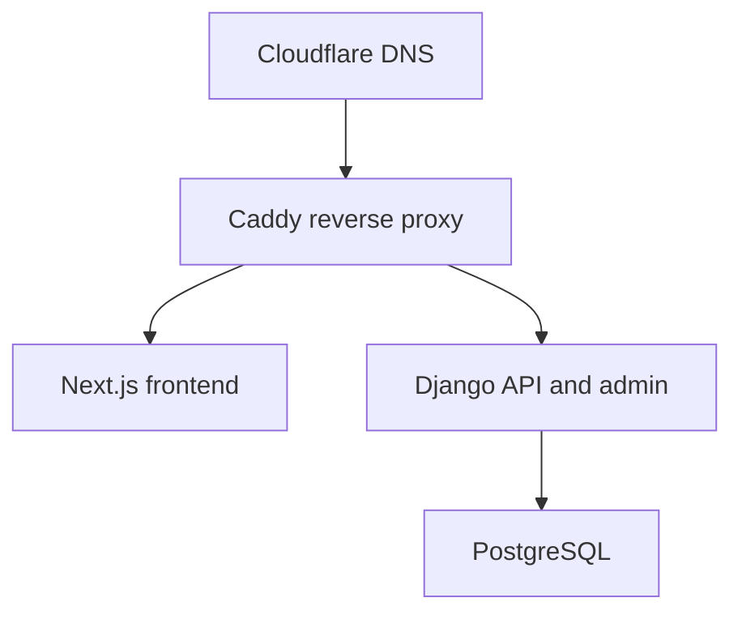

# Grayson’s Services

Production website and content-management system for **Grayson’s Services**, a property and outdoor-services company serving Southern Indiana and the Greater Midwest.

The project is a full-stack monorepo with a public Next.js website, a Django REST API, a branded Django Unfold administration site, PostgreSQL, transactional email, and a Docker-based production deployment behind Caddy and Cloudflare.

**Production:** [https://graysonsservices.com](https://graysonsservices.com)

## Features

### Public website

- Responsive home, services, projects, testimonials/reviews, FAQs, contact, and careers experiences
- Admin-managed company information, statistics, images, SEO content, and social links
- Categorized services with detailed descriptions, process information, and included items
- Filterable project portfolio with featured and homepage project layouts
- Customer reviews and project-linked testimonials
- Contact, estimate/quote, review, and job-application workflows
- Responsive image delivery, server-side image processing, and HEIF/HEIC support
- Accessible navigation, keyboard focus states, reduced-motion support, and scroll reveal animations
- Dynamic metadata, Open Graph content, sitemap, and canonical production URLs

### Administration

- Django Unfold administration interface
- Grayson’s Services logo, icon, favicon, and gold/stone color palette
- Structured content editing for services, projects, reviews, company settings, and careers
- Related-object inlines and ordered content
- Submission status workflows for contacts, quotes, reviews, and job applications
- Private résumé storage separate from public media
- Import/export support for administrative data

### Forms and email

- Server-side validation through Django REST Framework serializers
- Resend delivery through Django Anymail
- Owner notifications and customer confirmation messages
- Reply-to handling for direct responses
- Honeypot protection and independent burst/daily throttles
- File validation for uploaded photos and job-application documents

## Technology stack

| Layer | Technology |
| --- | --- |
| Frontend | Next.js 16, React 19, TypeScript, Tailwind CSS 4 |
| Backend | Django 6, Django REST Framework 3 |
| Admin | Django Unfold |
| Database | SQLite in development, PostgreSQL 17 in production |
| Email | Resend through Django Anymail |
| Images | Pillow, pillow-heif, Next.js Image, Sharp |
| Application server | Gunicorn |
| Containers | Docker Compose |
| Reverse proxy | Caddy |
| DNS and edge | Cloudflare |

The pinned dependency versions are authoritative in `backend/requirements.txt` and `frontend/package-lock.json`.

## Architecture



Caddy sends normal page requests to Next.js, routes `/api/*`, `/admin/*`, and `/static/*` to Django, and serves only the public-media volume. Private uploads are never mounted into or served by Caddy.

Next.js server components call Django over the private Docker network. Browser-side forms call the public HTTPS API through Caddy.

## Repository structure

```text
GRAYSONSSERVICES/
├── backend/
│   ├── config/
│   │   └── settings/
│   │       ├── base.py
│   │       ├── development.py
│   │       └── production.py
│   ├── core/
│   ├── services/
│   ├── projects/
│   ├── reviews/
│   ├── contact/
│   ├── careers/
│   ├── static/
│   │   └── admin-branding/
│   ├── docker/
│   ├── Dockerfile
│   ├── gunicorn.conf.py
│   ├── manage.py
│   └── requirements.txt
├── frontend/
│   ├── app/
│   ├── components/
│   ├── features/
│   ├── public/
│   ├── Dockerfile
│   ├── next.config.ts
│   ├── package.json
│   └── package-lock.json
├── compose.yml
├── .env.production.example
└── README.md
```

### Django applications

| App | Responsibility |
| --- | --- |
| `core` | Site settings, company statistics, shared image processing, health checks |
| `services` | Service categories, services, process content, included items |
| `projects` | Projects, galleries, featured/homepage ordering, categories |
| `reviews` | Reviews, ratings, sources, project links, featured ordering |
| `contact` | Contact submissions, estimate/quote requests, uploads, email workflows |
| `careers` | Job categories, job postings, requirements, responsibilities, applications |

## Local development

### Prerequisites

- Python 3.12+
- Node.js 22+
- npm
- Git

PostgreSQL and Docker are not required for normal local development. Django uses SQLite locally.

### 1. Clone the repository

```bash
git clone <repository-url>
cd GRAYSONSSERVICES
```

### 2. Configure and run Django

From PowerShell:

```powershell
cd backend
python -m venv .venv
.\.venv\Scripts\Activate.ps1
python -m pip install --upgrade pip
python -m pip install -r requirements.txt
```

Create `backend/.env`:

```dotenv
SECRET_KEY=development-only-secret
DEBUG=True
SEND_REAL_EMAILS=False

DEFAULT_FROM_EMAIL=Grayson's Services <webmaster@localhost>
CONTACT_NOTIFICATION_EMAIL=owner@example.test
QUOTE_NOTIFICATION_EMAIL=owner@example.test
CAREERS_NOTIFICATION_EMAIL=owner@example.test
```

With `SEND_REAL_EMAILS=False`, Django writes email messages to the terminal instead of contacting Resend.

Prepare the database and create an administrator:

```powershell
python manage.py migrate
python manage.py createsuperuser
python manage.py check
python manage.py runserver
```

Django is available at:

- API: [http://127.0.0.1:8000/api/](http://127.0.0.1:8000/api/)
- Admin: [http://127.0.0.1:8000/admin/](http://127.0.0.1:8000/admin/)

### 3. Configure and run Next.js

In a second terminal:

```powershell
cd frontend
npm ci
```

Create `frontend/.env.local`:

```dotenv
DJANGO_API_URL=http://127.0.0.1:8000
NEXT_PUBLIC_DJANGO_API_URL=http://127.0.0.1:8000
NEXT_PUBLIC_SITE_URL=http://localhost:3000
```

Start the development server:

```powershell
npm run dev
```

Open [http://localhost:3000](http://localhost:3000).

## Environment configuration

Never commit a populated production environment file. Production secrets live only on the VPS at:

```text
/opt/algoworld/secrets/graysons-services.env
```

The repository’s `.env.production.example` is the configuration checklist.

### Required production groups

| Group | Variables |
| --- | --- |
| Compose | `COMPOSE_PROJECT_NAME`, `CADDY_NETWORK` |
| Django | `DJANGO_SETTINGS_MODULE`, `SECRET_KEY`, `ALLOWED_HOSTS` |
| Browser security | `CORS_ALLOWED_ORIGINS`, `CSRF_TRUSTED_ORIGINS` |
| PostgreSQL | `DB_NAME`, `DB_USER`, `DB_PASSWORD`, `DB_HOST`, `DB_PORT` |
| Email | `RESEND_API_KEY`, `DEFAULT_FROM_EMAIL`, notification recipients |
| Frontend/API | `DJANGO_API_URL`, `NEXT_PUBLIC_DJANGO_API_URL`, `NEXT_PUBLIC_SITE_URL` |
| Storage | `STATIC_ROOT`, `MEDIA_ROOT`, `PRIVATE_MEDIA_ROOT`, `MEDIA_URL` |
| Runtime | Gunicorn workers, timeouts, throttle rates, HSTS settings |

Production settings reject missing values and obvious placeholders instead of starting with an unsafe configuration.

## API overview

The public JSON API is mounted beneath `/api/`.

| Method | Endpoint | Purpose |
| --- | --- | --- |
| `GET` | `/api/health/` | Database-backed health check |
| `GET` | `/api/site-settings/` | Public company and site settings |
| `GET` | `/api/company-stats/` | Public company statistics |
| `GET` | `/api/services/` | Active service details |
| `GET` | `/api/services/names/` | Lightweight service navigation data |
| `GET` | `/api/projects/` | Published projects, optionally filtered |
| `GET` | `/api/projects/featured/` | Featured projects |
| `GET` | `/api/projects/homepage/` | Homepage project selection |
| `GET` | `/api/projects/<slug>/` | Individual project details |
| `GET` | `/api/careers/jobs/` | Active job postings |
| `GET` | `/api/careers/jobs/<slug>/` | Individual job details |

Reviews and public submission endpoints are organized in their respective Django apps. Consult each app’s `urls.py` and serializer for the current request schema.

Public form views should use both:

```python
authentication_classes = ()
permission_classes = (AllowAny,)
```

`AllowAny` permits public access, while an empty authentication class list prevents an unrelated Django admin session cookie from triggering DRF session-authentication CSRF checks.

## Content management

Open `/admin/` and sign in with a Django administrator account. Content changes are stored in PostgreSQL and generally do **not** require a code deployment.

Next.js API fetches use a five-minute cache:

```ts
revalidate: 300
```

An admin change can therefore take up to five minutes to appear publicly. A frontend container rebuild also starts with a fresh process cache.

### Admin branding assets

Unfold branding is stored in:

```text
backend/static/admin-branding/
├── logo.png
├── icon.png
└── favicon.png
```

- `logo.png` is the full sidebar logo.
- `icon.png` is the compact mark used within the admin interface.
- `favicon.png` is the browser-tab icon.

If these assets live in the project-level `backend/static/` directory, `STATICFILES_DIRS` must include `BASE_DIR / "static"`. Verify an asset with:

```bash
python manage.py findstatic admin-branding/logo.png
```

Production’s `django_setup` service runs `collectstatic` during deployment. Browsers cache favicons aggressively, so use a hard refresh after replacing one.

## Validation and tests

Run backend checks from `backend/`:

```bash
python manage.py check
python manage.py test
```

Run frontend checks from `frontend/`:

```bash
npm ci
npm run lint
npm run build
```

Before committing:

```bash
git status --short
git diff --check
git diff
```

Validate the production Compose interpolation without starting containers:

```bash
docker compose --env-file /path/to/graysons-services.env config --quiet
```

## Production deployment

### Production paths

```text
Application: /opt/algoworld/sites/graysons-services
Environment: /opt/algoworld/secrets/graysons-services.env
Caddy:       /opt/algoworld/infrastructure/caddy
```

### Docker services

| Service | Role |
| --- | --- |
| `postgres` | Persistent PostgreSQL database |
| `django_setup` | One-shot migrations, static collection, deployment checks |
| `backend` | Gunicorn/Django API and admin |
| `frontend` | Next.js standalone production server |

### Deploy a new Git commit

SSH into `algoworld-production-01`, then run:

```bash
cd /opt/algoworld/sites/graysons-services
ENV_FILE=/opt/algoworld/secrets/graysons-services.env

git status --short
git branch --show-current
git pull --ff-only

docker compose --env-file "$ENV_FILE" config --quiet
docker compose --env-file "$ENV_FILE" build
docker compose --env-file "$ENV_FILE" up -d

docker compose --env-file "$ENV_FILE" ps
```

The deployment automatically:

1. Builds the new Django and Next.js images.
2. Waits for PostgreSQL to become healthy.
3. Runs Django migrations.
4. Collects static assets.
5. Runs `manage.py check --deploy`.
6. Recreates the application containers after the setup step succeeds.

Database data, uploads, static files, and caches remain in persistent Docker volumes. A normal application update does not require a Caddy restart or Cloudflare change.

### Verify a deployment

```bash
curl -I --max-time 20 https://graysonsservices.com/
curl --fail --max-time 20 https://graysonsservices.com/api/health/

docker compose --env-file "$ENV_FILE" ps backend frontend
```

The site should return a successful response, the health endpoint should report healthy, and both application containers should become healthy.

### Inspect deployment failures

```bash
docker compose --env-file "$ENV_FILE" logs \
  --tail=150 \
  django_setup backend frontend
```

## Persistent storage

Production uses named volumes so container recreation does not erase site data.

| Volume | Contents |
| --- | --- |
| `graysons-services-postgres-data` | PostgreSQL database |
| `graysons-services-static` | Collected Django static assets |
| `graysons-services-public-media` | Public site uploads |
| `graysons-services-private-media` | Private résumés and protected uploads |
| `graysons-services-django-cache` | Shared Django file cache |
| `graysons-services-next-cache` | Next.js runtime/build cache |

Private media must never be exposed through Caddy. Job-application résumés are stored privately and accept validated PDF, DOC, or DOCX files.

## Production security

- PostgreSQL is available only on the internal application network.
- Django and Next.js publish no VPS host ports; Caddy reaches them over a shared Docker network.
- Application containers run as unprivileged users with read-only root filesystems.
- Linux capabilities are dropped and `no-new-privileges` is enabled.
- HTTPS redirects, secure session/CSRF cookies, HSTS, clickjacking protection, and strict origin lists are configured in production.
- Form endpoints use validation, throttling, and honeypot checks.
- Caddy mounts public media read-only and does not mount private media.
- Secrets and production credentials remain outside Git.

## Common issues

### A public form returns `403 CSRF token missing`

If the form works while signed out or in an incognito window, the browser is sending a Django admin session cookie. Keep `permission_classes = (AllowAny,)` and add `authentication_classes = ()` to that intentionally public DRF view.

Do not disable Django’s CSRF middleware or apply a global CSRF exemption.

### Admin branding returns `/static/...` 404

Confirm the file is under `backend/static/admin-branding/`, add the project static directory to `STATICFILES_DIRS`, and run:

```bash
python manage.py findstatic admin-branding/logo.png --verbosity 2
python manage.py collectstatic --noinput
```

### Admin content appears stale

Wait up to five minutes for the `revalidate: 300` cache window. Content edits do not normally require a rebuild.

### Containers are unhealthy

Inspect `django_setup`, `backend`, and `frontend` logs. The backend will not start unless PostgreSQL is healthy and the setup service completes successfully; the frontend waits for a healthy backend.

## Operational notes

- The canonical URL is `https://graysonsservices.com`.
- `https://www.graysonsservices.com` permanently redirects to the canonical non-`www` domain.
- Local development uses `config.settings.development` and SQLite.
- Production uses `config.settings.production` and PostgreSQL.
- WhiteNoise serves collected static assets; Caddy serves public user uploads.
- The shared Django file cache is appropriate for the current single-VPS deployment. Move to a network cache such as Redis before scaling Django across multiple hosts.
- Increase HSTS duration or enable subdomain/preload flags only after every affected hostname has been deliberately verified over HTTPS.

## Ownership

Built and maintained by **Algoworld Digital LLC** for **Grayson’s Services**.

This repository is private and proprietary unless a separate license states otherwise.
